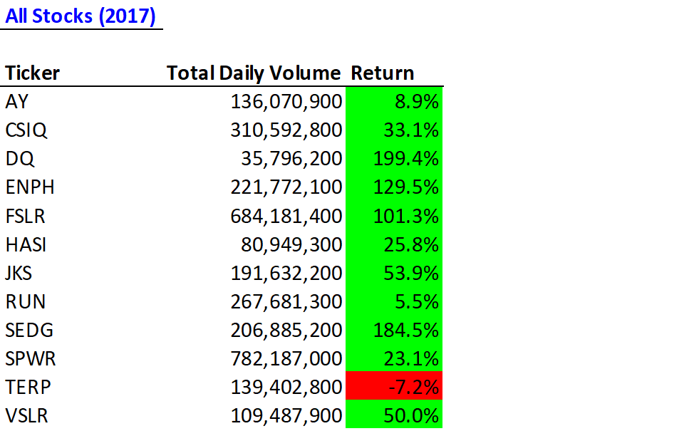
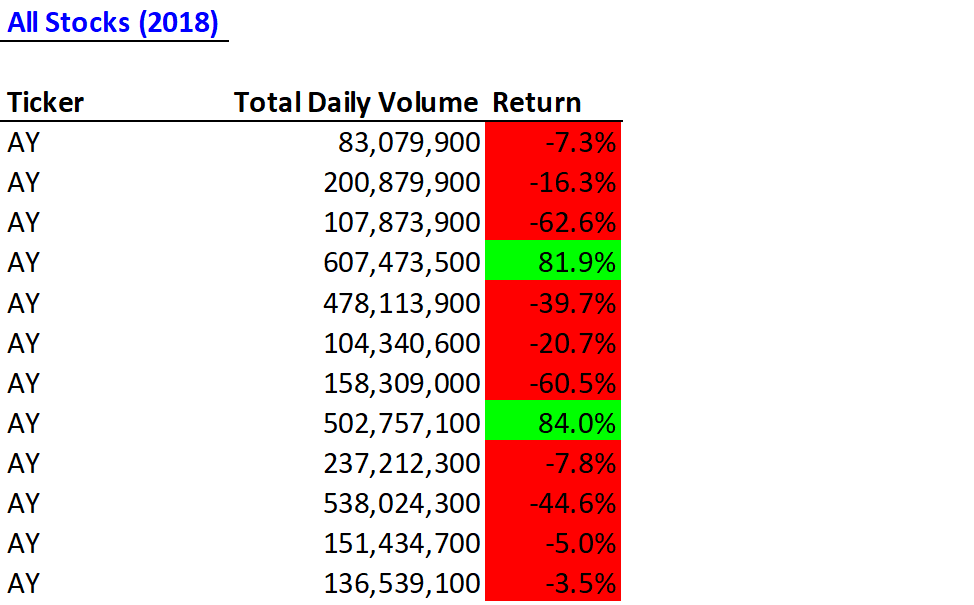

# stock-analysis
Using VBA to analyze financial trends

Overview of Project: Steve is looking at the performance of DAQO New Energy Group, a company that invests in solar panels. Steve is looking at in the DAQO data from 2017 and 2018, in context of a number of other renewable energy stocks. 

## About the Data
The data has 8 columns: **Ticker,	Date,	Open,	High,	Low,	Close,	Adj Close,	and Volume.** Both 2017 and 2018 data have 3,013 rows. The variable **Ticker** is comprised of 11 different stock tickers. The **Date** starts at January 3rd for each year and goes through December 29. **High** and **Low** show the highest and lowest prices of the stock during the day. **Open** and **Close** show the initial and final price of the stock that trading day. **Adj Close** shows the adjusted closing price, which is a more complex analysis that uses the closing price as a starting point, but it takes into account factors such as dividends, stock splits and new stock offerings to determine a value. The adjusted closing price represents a more accurate reflection of a stock's value, since distributions and new offerings can alter the closing price. **Volume** the number of shares of a security traded between its daily open and close.

## Analysis of All Stocks
Steve believes that if a stock is traded often, then the price will accurately reflect the value of the stock, so he wants to look at this. If we sum up all of the daily volume for DQ, we'll have the yearly volume and a rough idea of how often it gets traded. Steve also wants to see return, so we are doing blah blah,
We also want to make sure we are doing all this as efficiently as we can, so we are going to time how long it takes VBA to perform this.

To do this we created the following macro:

    Sub AllStocksAnalysis()
    
        ' We want this to be efficient, so we are measuring how long it takes VBA to fun the Macro
        Dim startTime As Single
        Dim endTime  As Single
   
        ' The user enters which year they want to run analysis for here:
        yearValue = InputBox("What year would you like to run the analysis on?")
         
         startTime = Timer

        '1) Format the output sheet on All Stocks Analysis worksheet
              'Activate output worksheet
               Worksheets("All Stocks Analysis").Activate
    
              'Title
              Range("A1").Value = "All Stocks (" + yearValue + ")"
    
             'Creating a header row
              Cells(3, 1).Value = "Ticker"
              Cells(3, 2).Value = "Total Daily Volume"
              Cells(3, 3).Value = "Return"
    
        '2) Initialize array of all tickers
              Dim tickers(12) As String
              tickers(0) = "AY"
              tickers(1) = "CSIQ"
              tickers(2) = "DQ"
              tickers(3) = "ENPH"
              tickers(4) = "FSLR"
              tickers(5) = "HASI"
              tickers(6) = "JKS"
              tickers(7) = "RUN"
              tickers(8) = "SEDG"
              tickers(9) = "SPWR"
              tickers(10) = "TERP"
              tickers(11) = "VSLR"
    
        '3a) Initialize variables for starting price and ending price
              Dim startingPrice As Double
              Dim endingPrice As Double

        '3b) Activate data worksheet
               Worksheets(yearValue).Activate
    
        '3c) Get the number of rows to loop over
              RowCount = Cells(Rows.Count, "A").End(xlUp).Row

        '4) Loop through tickers
              For i = 0 To 11
                  ticker = tickers(i)
                  totalVolume = 0
       
                  '5) loop through rows in the data
                   Worksheets(yearValue).Activate
                   For j = 2 To RowCount
       
                      '5a) Get total volume for current ticker
                       If Cells(j, 1).Value = ticker Then
                       
                                totalVolume = totalVolume + Cells(j, 8).Value
                
                       End If

                      '5b) Get starting price for current ticker
                       If Cells(j, 1).Value = ticker And Cells(j - 1, 1).Value <> ticker Then
                   
                                startingPrice = Cells(j, 6).Value
                
                       End If
            
                      '5c) Get ending price for current ticker
                       If Cells(j, 1).Value = ticker And Cells(j + 1, 1).Value <> ticker Then
                  
                                endingPrice = Cells(j, 6).Value
                
                       End If

                   Next j
       
              '6) Output data for current ticker
               Worksheets("All Stocks Analysis").Activate
               Cells(4 + i, 1).Value = ticker
               Cells(4 + i, 2).Value = totalVolume
               Cells(4 + i, 3).Value = endingPrice / startingPrice - 1

           Next i
    
    endTime = Timer
    MsgBox "This code ran in " & (endTime - startTime) & " seconds for the year " & (yearValue)

    End Sub

Here are the results:

### Returns

## Refractored Analysis of All Stocks

Results: Using images and examples of your code, compare the stock performance between 2017 and 2018, as well as the execution times of the original script and the refactored script.

Summary: In a summary statement, address the following questions.
What are the advantages or disadvantages of refactoring code?
How do these pros and cons apply to refactoring the original VBA script?
