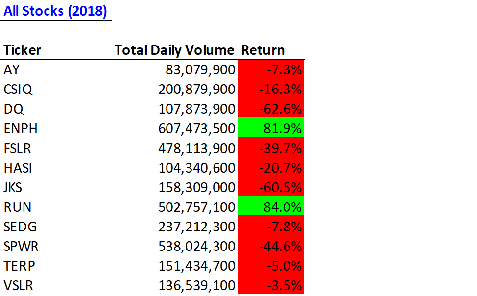

# stock-analysis
Using VBA to analyze financial trends

Overview of Project: Steve is looking at the performance of DAQO New Energy Group, a company that invests in solar panels. Steve is looking at in the DAQO data from 2017 and 2018, in context of a number of other renewable energy stocks. 

## About the Data
The data has 8 columns: **Ticker,	Date,	Open,	High,	Low,	Close,	Adj Close,	and Volume.** Both 2017 and 2018 data have 3,013 rows. The variable **Ticker** is comprised of 11 different stock tickers. The **Date** starts at January 3rd for each year and goes through December 29. **High** and **Low** show the highest and lowest prices of the stock during the day. **Open** and **Close** show the initial and final price of the stock that trading day. **Adj Close** shows the adjusted closing price, which is a more complex analysis that uses the closing price as a starting point, but it takes into account factors such as dividends, stock splits and new stock offerings to determine a value. The adjusted closing price represents a more accurate reflection of a stock's value, since distributions and new offerings can alter the closing price. **Volume** the number of shares of a security traded between its daily open and close.

## Analysis of All Stocks
Steve believes that if a stock is traded often, then the price will accurately reflect the value of the stock, so he wants to look at this. If we sum up all of the daily volume for DQ, we'll have the yearly volume and a rough idea of how often it gets traded. Steve also wants to see return, so we are doing blah blah,
We also want to make sure we are doing all this as efficiently as we can, so we are going to time how long it takes VBA to perform this.

To do this we created the following macro:

    Sub AllStocksAnalysis()
    
        ' We want this to be efficient, so we are measuring how long it takes VBA to fun the Macro
        Dim startTime As Single
        Dim endTime  As Single
   
        ' The user enters which year they want to run analysis for here:
        yearValue = InputBox("What year would you like to run the analysis on?")
         
         startTime = Timer

        '1) Format the output sheet on All Stocks Analysis worksheet
              'Activate output worksheet
               Worksheets("All Stocks Analysis").Activate
    
              'Title
              Range("A1").Value = "All Stocks (" + yearValue + ")"
    
             'Creating a header row
              Cells(3, 1).Value = "Ticker"
              Cells(3, 2).Value = "Total Daily Volume"
              Cells(3, 3).Value = "Return"
    
        '2) Initialize array of all tickers
              Dim tickers(12) As String
              tickers(0) = "AY"
              tickers(1) = "CSIQ"
              tickers(2) = "DQ"
              tickers(3) = "ENPH"
              tickers(4) = "FSLR"
              tickers(5) = "HASI"
              tickers(6) = "JKS"
              tickers(7) = "RUN"
              tickers(8) = "SEDG"
              tickers(9) = "SPWR"
              tickers(10) = "TERP"
              tickers(11) = "VSLR"
    
        '3a) Initialize variables for starting price and ending price
              Dim startingPrice As Double
              Dim endingPrice As Double

        '3b) Activate data worksheet
               Worksheets(yearValue).Activate
    
        '3c) Get the number of rows to loop over
              RowCount = Cells(Rows.Count, "A").End(xlUp).Row

        '4) Loop through tickers
              For i = 0 To 11
                  ticker = tickers(i)
                  totalVolume = 0
       
                  '5) loop through rows in the data
                   Worksheets(yearValue).Activate
                   For j = 2 To RowCount
       
                      '5a) Get total volume for current ticker
                       If Cells(j, 1).Value = ticker Then
                       
                                totalVolume = totalVolume + Cells(j, 8).Value
                
                       End If

                      '5b) Get starting price for current ticker
                       If Cells(j, 1).Value = ticker And Cells(j - 1, 1).Value <> ticker Then
                   
                                startingPrice = Cells(j, 6).Value
                
                       End If
            
                      '5c) Get ending price for current ticker
                       If Cells(j, 1).Value = ticker And Cells(j + 1, 1).Value <> ticker Then
                  
                                endingPrice = Cells(j, 6).Value
                
                       End If

                   Next j
       
              '6) Output data for current ticker
               Worksheets("All Stocks Analysis").Activate
               Cells(4 + i, 1).Value = ticker
               Cells(4 + i, 2).Value = totalVolume
               Cells(4 + i, 3).Value = endingPrice / startingPrice - 1

           Next i
    
    endTime = Timer
    MsgBox "This code ran in " & (endTime - startTime) & " seconds for the year " & (yearValue)

    End Sub

## What is this code doing?
Here we are creating a nested for loop, where we are looping each ticker through all 3,013 rows. We first set **tickerVolume** equal to zero. Then we begin the first for loop setting i equal to zero and **ticker** = *AY*. Then we begin the second for loop, where j (row number) equals 2. We already set **totalVolume** equal to zero, and we are adding the value from the 2nd row and 8th colume to become the new **totalVolume**. This iteration will satisfy the first If Statement 5a because it is the first row of this ticker. Therefore, it pulls the **startingPrice** from the 6th column of this row. This iteration failes the second If Statement 5b because it is not the last row of this ticker. The loop then moves on to the 3rd row, where the new **totalVolume** is calculated and 5a and 5b fail. This continues until we reach the final row of *AY* which is 252. Once j=252, the final **totalVolume** for *AY* is calculated, the If Statement 5b is satisfied, and **endingPrice** is pulled. 

Then we continue this process through all the rows until the last row 3,013, except with all rows beyond 252, the If Statements in 5a, 5b, and 5c all fail and no variable values are changed becuase the ticker is no longer *AY*. Once row 3,1013 is reached, we output the variable values as shown in Step 6. Then, we go back to Step 4 and repeat the entire process for i=1.    

Here are the results:

#Interpret results

It is great that we got those results, but that took a long time. It wasn't super efficient to make VBA go through all 3,013 rows 11 times. Here is how long it took VBA to run our code:

We can be more efficient! We will now refractor our code to try to make it run faster.  When refactoring code, we aren’t adding new functionality; we just want to make the code more efficient—by taking fewer steps, using less memory, or improving the logic of the code to make it easier for future users to read. Here is the new macro:

## Refractored Analysis of All Stocks

    Sub AllStocksAnalysisRefactored()

        'Copy + paste steps through 3c from previous AllStocksAnalysis()
    
         '1a) Create a ticker Index
          Dim tickerIndex As Long
          tickerIndex = 0

          '1b) Create three output arrays
           Dim tickerVolumes(11) As Long
           Dim tickerStartingPrices(11) As Single
           Dim tickerEndingPrices(11) As Single
    
          '2a) Create a for loop to initialize the tickerVolumes to zero.
           For x = 0 To 11
                tickerVolumes(x) = 0
           Next x

           '2b) Loop over all the rows in the spreadsheet.
           Worksheets(yearValue).Activate
    
           For i = 2 To RowCount
    
                '3a) Increase volume for current ticker
                 tickerVolumes(tickerIndex) = tickerVolumes(tickerIndex) + Cells(i, 8).Value
        
                '3b) Check if the current row is the first row with the selected tickerIndex.
                 If Cells(i, 1).Value = tickers(tickerIndex) And Cells(i - 1, 1).Value <> tickers(tickerIndex) Then
                        tickerStartingPrices(tickerIndex) = Cells(i, 6).Value       
                 End If
         
                 '3c) check if the current row is the last row with the selected tick
                  If Cells(i, 1).Value = tickers(tickerIndex) And Cells(i + 1, 1).Value <> tickers(tickerIndex) Then
                        tickerEndingPrices(tickerIndex) = Cells(i, 6).Value
                
                        '3d) Increase the tickerIndex.
                         tickerIndex = tickerIndex + 1
                   End If
        
           Next i
   
          '4) Loop through your arrays to output the Ticker, Total Daily Volume, and Return.
           For i = 0 To 11
                Worksheets("All Stocks Analysis").Activate
                Cells(4 + i, 1).Value = tickers(i)
                Cells(4 + i, 2).Value = tickerVolumes(i)
                Cells(4 + i, 3).Value = tickerEndingPrices(i) / tickerStartingPrices(i) - 1
            Next i
    
        'Copy + paste formatting code from AllStocksAnalysis()
 
    endTime = Timer
    MsgBox "This (refractored) code ran in " & (endTime - startTime) & " seconds for the year " & (yearValue)

    End Sub

## What is this code doing? Let's go through it step by step to understand how it is different from AllStocksAnalysis(). 
First we need to create a **tickerIndex** that will serve as an index for a number of different variables. We want to set it equal to 0 becuase we want to start with ticker(0)= *AY*, as defined in AllStocksAnalysis() Step 2. When we initialize the variables **totalVolumes, tickerStartingPrices,** and **tickerEndingPrices**, we need to make them as arrays that hold 11 different values that correspond with each of the tickers. Then in Step 2a, we must create a for loop so that for each ticker, **totalVolumes**=0 initially.

For Step 3a, **tickerIndex** is still equal to zero as definied in Step 1. In Step 2a, we defined **totalVolumes** regardless of ticker as equal to zero. The second part of the expression pulls the value from the 2nd row and 8th column, which is the Volume for ticker AY on January 3rd, 2020. We set that as the new **totalVolumes** for ticker *AY*. We now need to find **tickerStartingPrices**. We do this the same way we did in AllStocksAnalysis(). This was only the second row, so the If statement in 3c will fail. Then we move to the next row, and back to 3a. **totalVolumes** is now a nonzero number, and we add the value from row 3 column 8 to get a new **totalVolumes**. The next two Is Statements fail. This process repeats until we reach the last row (252) of ticker *AY*. Then, the If statement in 3c is satisfied and **tickerEndingPrice** is calculated for *AY*. Also, in Step 3d, we are changing **tickerIndex** from 0 to 1. Then we carry on to the next row (253), but now the ticker is set to *CSIQ*. The process repeats for every ticker.

We didn't need to include the output in the original for loop, becuase the data is stored in the arrays we created. We now just need to call them and say where we want them printed, which we do in Step 4.

The result is much faster run times!

## Summary: 
The advantage of refractoring code is you make the process more efficient. You can hedge minimize the risk of the program lagging or crashing, which is always important when doing data analysis. 

What are the advantages or disadvantages of refactoring code?
How do these pros and cons apply to refactoring the original VBA script?
